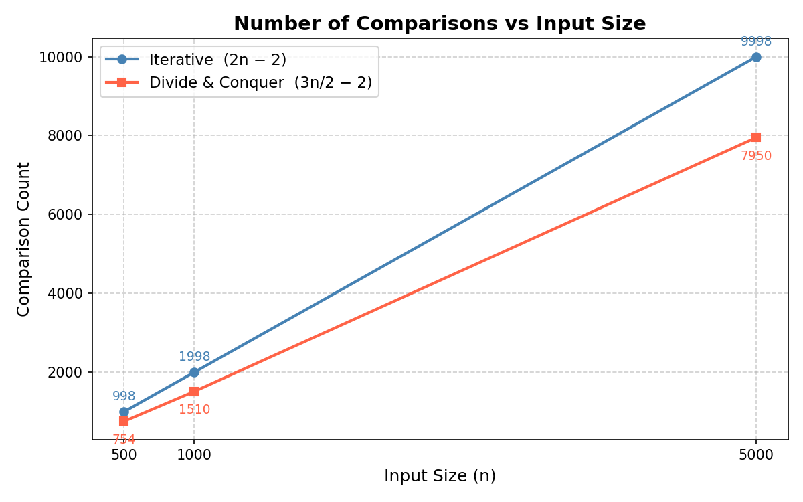
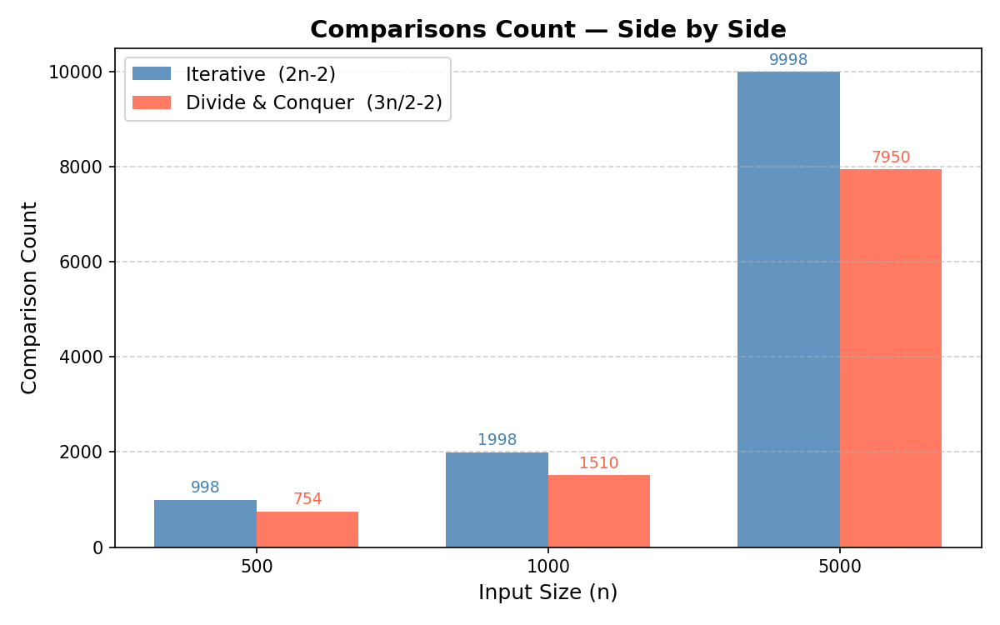
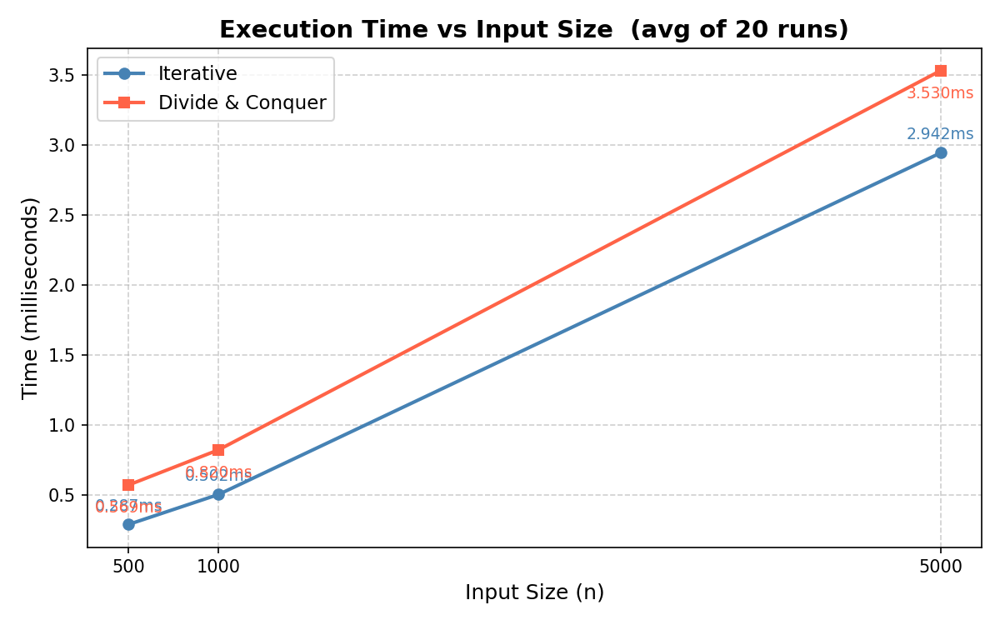
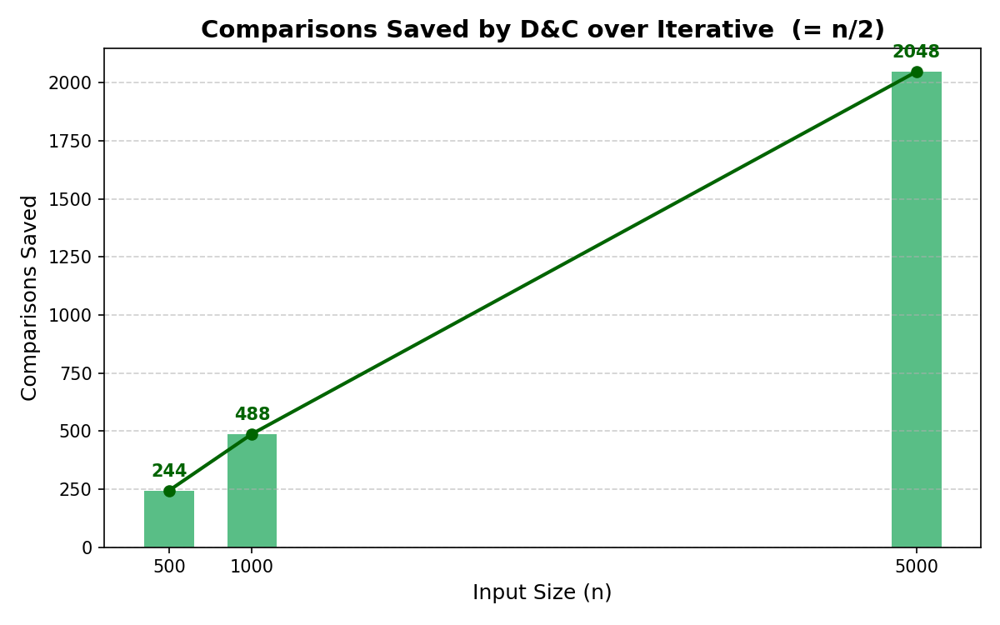
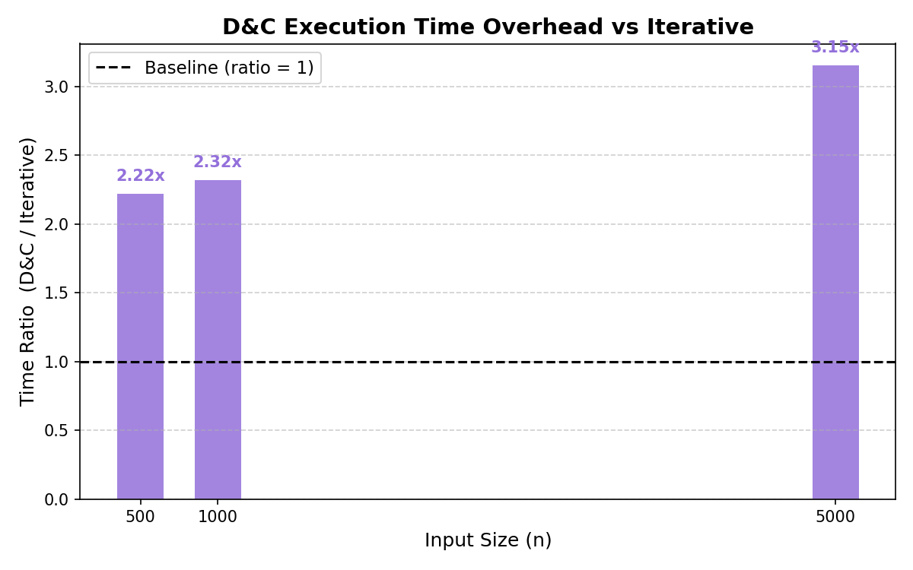
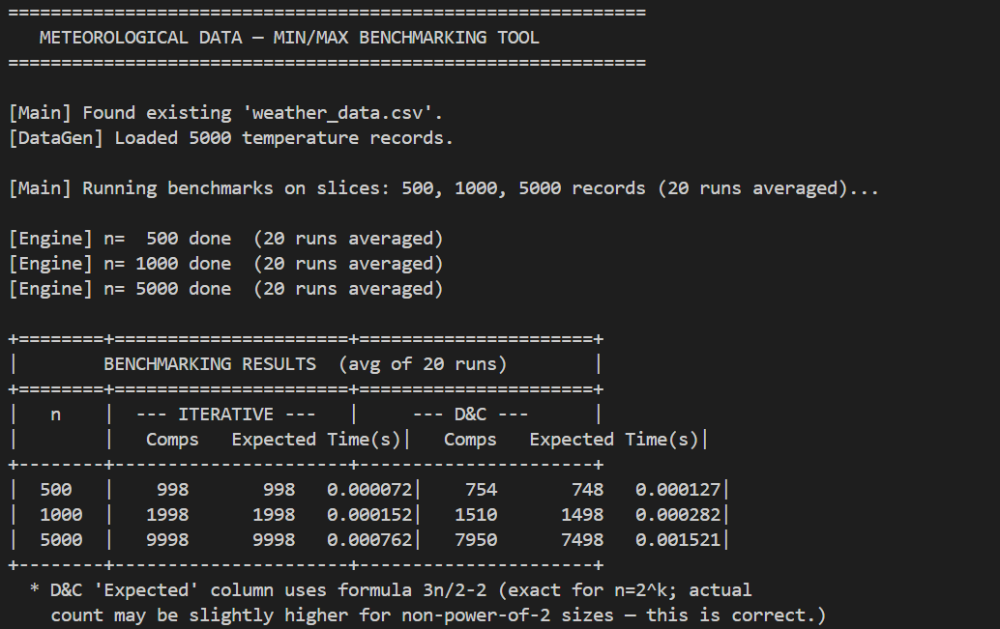
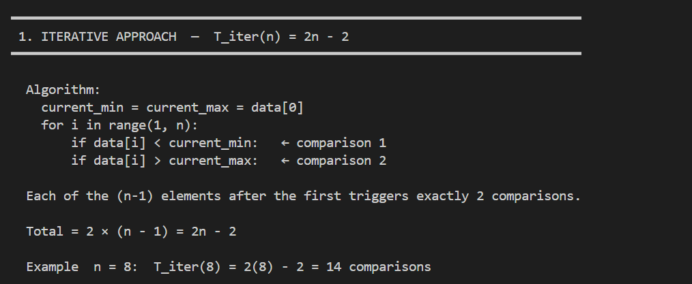
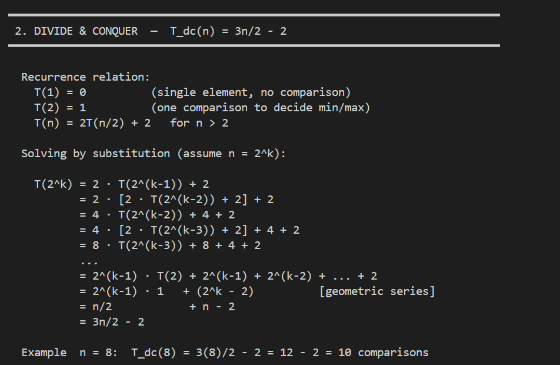
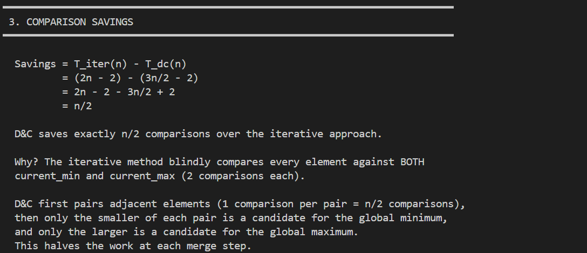
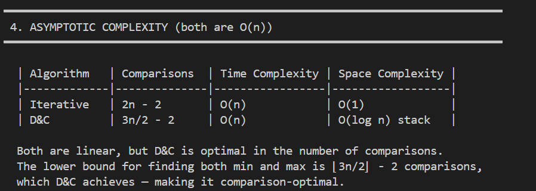

# Meteorological Data — Min/Max Benchmarking Tool

A pure-Python performance benchmarking tool that compares two algorithmic
approaches for finding the minimum and maximum temperature in large datasets.

---

## Project Structure

```
weather_benchmarker/
├── dataset_generator.py        # Module A — WeatherLoader class (generate + load CSV)
├── iterative_min_max.py        # Module B — Iterative algorithm
├── divide_conquer_min_max.py   # Module B — Divide & Conquer algorithm
├── analysis_engine.py          # Module C — Benchmark runner + table printer
├── visualizer.py               # Chart generator (saves PNG files)
├── main.py                     # Entry point
├── README.md                   # This file
├── weather_data.csv            # Auto-generated at runtime (5,000 records)
└── screenshots/                # Charts and terminal output screenshots
    ├── comparisons_chart.png
    ├── comparisons_bar_chart.png
    ├── execution_time_chart.png
    ├── savings_chart.png
    ├── time_ratio_chart.png
    └── screenshot-*.png            # Terminal output screenshots
```

---

## How to Run

```bash
cd weather_benchmarker
python main.py
```


## Algorithms

### Iterative  —  `iterative_min_max.py`

Single-pass scan. Initialises `current_min` and `current_max` to the first
element, then checks every subsequent element with **2 comparisons**.

```
for i in range(1, n):
    if data[i] < current_min  → comparison 1
    if data[i] > current_max  → comparison 2
```

**Total comparisons: `2(n-1) = 2n - 2`**

---

### Divide & Conquer  —  `divide_conquer_min_max.py`

Recursive split following the recurrence `T(n) = 2T(n/2) + 2`.

```
find_min_max(arr, low, high):
    base case 1 element  → return (arr[low], arr[low])   # 0 comparisons
    base case 2 elements → 1 comparison, return (min, max)
    mid = (low + high) // 2
    left_min,  left_max  = find_min_max(arr, low,   mid)
    right_min, right_max = find_min_max(arr, mid+1, high)
    overall_min = left_min  < right_min ? left_min  : right_min   # +1
    overall_max = left_max  > right_max ? left_max  : right_max   # +1
```

**Total comparisons: `3n/2 - 2`**

---

## Benchmark Results

Each algorithm is run **20 times** per input size and the average execution
time is recorded to eliminate timing noise.

### Comparisons — Line Chart



### Comparisons — Bar Chart (Side by Side)



### Execution Time



### Comparisons Saved by D&C (= n/2)



### D&C Time Overhead vs Iterative



---

## Screenshots

### Benchmark Table Output







### Math Proof Output





---


## Complexity Summary

| Algorithm   | Comparisons | Time  | Space      |
|-------------|-------------|-------|------------|
| Iterative   | `2n - 2`    | O(n)  | O(1)       |
| D&C         | `3n/2 - 2`  | O(n)  | O(log n) * |

\* Stack depth due to recursion.

D&C is **comparison-optimal** — the theoretical lower bound for finding both
min and max simultaneously is `⌊3n/2⌋ - 2`, which D&C achieves exactly.

---

## Dataset Format

`weather_data.csv` — 5,000 rows, columns: `id`, `date`, `temperature_celsius`

```
id,date,temperature_celsius
1,2010-01-01,23.45
2,2010-01-02,-12.30
...
```

Temperature values are random floats in the range **[-30.0, 50.0]** Celsius.
